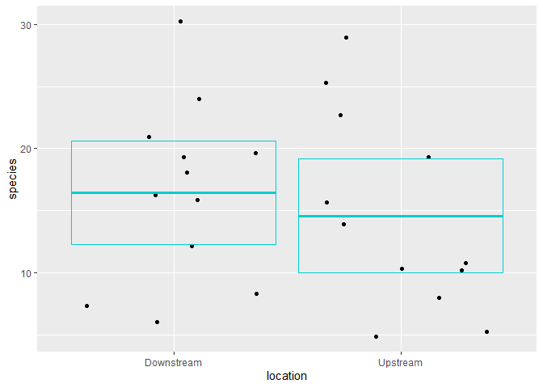

Lab 6 Comparing two means
================
Beau Ayers
4/26/2021

Researchers studying the number of electric fish species living in
various parts of the Amazon basin were interested in whether the
presence of tributaries affected the local number of electric fish
species in the main rivers (Fernandes et al. 2004).

They counted the number of electric fish species above and below the
entrance point of a major tributary at 12 different river locations.

The data is provided in your GitHub repository.

For each question below, write a sentence answering the question and
show the code you used to come up with the answer, if applicable.

## Question A

> What is the mean different in the number of species between areas
> upstream and downstream of a tributary? What is the 95% confidence
> interval of this mean difference. Show your code and write a sentence
> giving your answer

ANSWER

``` r
# load packages -----------------------------------------------------------

library(tidyverse)
```

    ## -- Attaching packages --------------------------------------- tidyverse 1.3.0 --

    ## v ggplot2 3.3.3     v purrr   0.3.4
    ## v tibble  3.1.0     v dplyr   1.0.5
    ## v tidyr   1.1.3     v stringr 1.4.0
    ## v readr   1.4.0     v forcats 0.5.1

    ## -- Conflicts ------------------------------------------ tidyverse_conflicts() --
    ## x dplyr::filter() masks stats::filter()
    ## x dplyr::lag()    masks stats::lag()

``` r
# read data ---------------------------------------------------------------

fish <- read_csv("chap12q19ElectricFish.csv")
```

    ## 
    ## -- Column specification --------------------------------------------------------
    ## cols(
    ##   tributary = col_character(),
    ##   speciesUpstream = col_double(),
    ##   speciesDownstream = col_double()
    ## )

``` r
# put data in tidy format ------------------------------------------------

fish_long <- 
  pivot_longer(fish, speciesUpstream:speciesDownstream,
               names_to = "location",
               values_to = "species") %>% 
  mutate(location = str_remove(location, c("species"))) %>% 
  print()
```

    ## # A tibble: 24 x 3
    ##    tributary location   species
    ##    <chr>     <chr>        <dbl>
    ##  1 Içá       Upstream        14
    ##  2 Içá       Downstream      19
    ##  3 Jutaí     Upstream        11
    ##  4 Jutaí     Downstream      18
    ##  5 Japurá    Upstream         8
    ##  6 Japurá    Downstream       8
    ##  7 Coari     Upstream         5
    ##  8 Coari     Downstream       7
    ##  9 Purus     Upstream        10
    ## 10 Purus     Downstream      16
    ## # ... with 14 more rows

``` r
# do stuff ----------------------------------------------------------------

ttest_results <- t.test(formula = species ~ location, data = fish_long)

ttest_results
```

    ## 
    ##  Welch Two Sample t-test
    ## 
    ## data:  species by location
    ## t = 0.59249, df = 21.81, p-value = 0.5596
    ## alternative hypothesis: true difference in means is not equal to 0
    ## 95 percent confidence interval:
    ##  -4.587031  8.253697
    ## sample estimates:
    ## mean in group Downstream   mean in group Upstream 
    ##                 16.41667                 14.58333

The mean difference is 1.833333. The 95% confidence interval is
-4.587031 to 8.253697.

## Question B

> Test the hypothesis that the tributaries have no effect on the number
> of species of electric fish.

ANSWER

``` r
ttest_results <- t.test(formula = species ~ location, data = fish_long)

ttest_results
```

    ## 
    ##  Welch Two Sample t-test
    ## 
    ## data:  species by location
    ## t = 0.59249, df = 21.81, p-value = 0.5596
    ## alternative hypothesis: true difference in means is not equal to 0
    ## 95 percent confidence interval:
    ##  -4.587031  8.253697
    ## sample estimates:
    ## mean in group Downstream   mean in group Upstream 
    ##                 16.41667                 14.58333

There is no evidence that tributries have an effect on the number of
species because the p-value is greater than 0.05.

## Question C

> State the assumptions that you had to make to complete parts (A) and
> (B). Create a graph to assess whether one of those assumptions was
> met.

ANSWER

``` r
fish_sum <-
  fish_long %>%
  group_by(location) %>%
  summarize(
    sampl_size = n(),
    mean = mean(species),
    str_dev = sd(species),
    var = var(species),
    sem = sd(species) / sqrt(n()),
    ci_upper = mean + 2 * sem,
    ci_lower = mean - 2 * sem,
  )

fish_sum
```

    ## # A tibble: 2 x 8
    ##   location   sampl_size  mean str_dev   var   sem ci_upper ci_lower
    ##   <chr>           <int> <dbl>   <dbl> <dbl> <dbl>    <dbl>    <dbl>
    ## 1 Downstream         12  16.4    7.22  52.1  2.08     20.6     12.2
    ## 2 Upstream           12  14.6    7.93  62.8  2.29     19.2     10.0

``` r
ggplot(data = fish_long) +
  geom_jitter(mapping = aes(x = location, y = species)) +
  geom_crossbar(
    data = fish_sum,
    mapping = aes(x = location, y = mean, ymax = ci_upper, ymin = ci_lower),
    color = "cyan3"
  )
```

<!-- -->

I had to assume that the p-value was 0.05.
